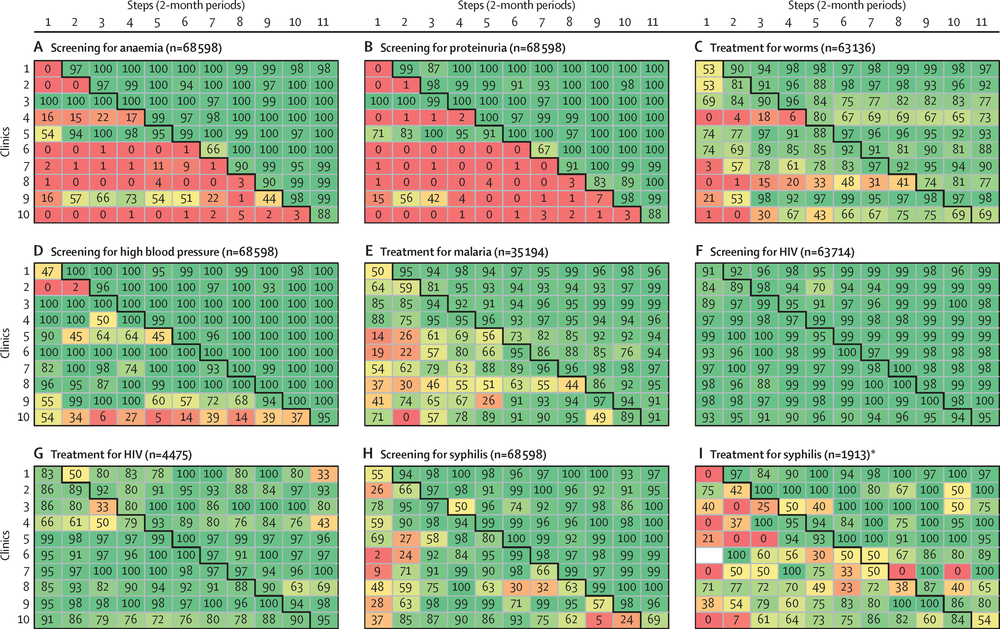

## Antenatal Care in Mozambique:
#### Interactive Stepped-Wedge Cluster Randomised Trial Data Analysis Tool

#### Enhance scientific reproducibility
This Shiny app is designed to replicate the results of a Stepped-Wedge Pragmatic Cluster Randomized Controlled Trial conducted to improve the quality of antenatal care in Mozambique.

The trial, published in The Lancet Global Health, evaluated the impact of providing medical supply kits to antenatal care clinics.

This app allows users to explore the trial data interactively through a pivot table widget, enabling them to analyze outcome measures such as blood pressure, proteinuria, and syphilis testing rates without requiring advanced statistical or programming skills.

The app was developed to enhance scientific reproducibility by making the trial data accessible and analyzable for researchers, practitioners, and policymakers.

The source code for this R Shiny app and the dataset are available for download within the app and at github.

#### ...
#### Lancet Global Health Paper:

##### Reference:

AP Betrán,E. Bergel, S. Griffin,A. Melo, MH Nguyen, A. Carbonell,S. Mondlane,M. Merialdi,M. Temmerman, AM Gülmezoglu, A. German,F. Althabe,A. Biza,B. Crahay,L. Chavane,M. Colomar,T. Delvaux,U. Dyke Ali,L. Fersurela,D. Geelhoed,I. Jille-Taas,CR Malapende,C. Langa, NB Osman, J. Requejo and G. Timbe. Provision of medical supply kits to improve quality of antenatal care in Mozambique: a stepped-wedge cluster randomized trial. The Lancet Global Health. 2018;6(1):https://doi.org/10.1016/S2214-109X(17)30421-7.

#### Provision of medical supply kits to improve quality of antenatal care in Mozambique: a stepped-wedge cluster randomised trial

Ana Pilar Betrán, Eduardo Bergel, Sally Griffin, Armando Melo, My Huong Nguyen, Alicia Carbonell, Santos Mondlane, Mario Merialdi, Marleen Temmerman, A Metin Gülmezoglu, for the WHO Antenatal Care Trial in Mozambique Research Group*

##### Summary

##### Background 
High levels of maternal and newborn mortality and morbidity remain a daunting reality in many low- income countries. Several interventions delivered during antenatal care have been shown to improve maternal and newborn outcomes, but stockouts of medical supplies at point of care can prevent implementation of these services. We aimed to evaluate whether a supply chain strategy based on the provision of kits could improve quality of care.

##### Methods
We did a pragmatic, stepped-wedge, cluster-randomised controlled trial at ten antenatal care clinics in Mozambique. Clinics were eligible if they were not already implementing the proposed antenatal care package; they served at least 200 new pregnant women per year; they had Maternal and Child Health (MCH) nurses; and they were willing to participate. All women attending antenatal care visits at the participating clinics were included in the trial. Participating clinics were randomly assigned to shift from control to intervention on prespecified start dates. The intervention involved four components (kits with medical supplies, a cupboard to store these supplies, a tracking sheet to monitor stocks, and a one-day training session). The primary outcomes were the proportion of women screened for anaemia and proteinuria, and the proportion of women who received mebendazole in the first antenatal care visit. The intervention was delivered under routine care conditions, and analyses were done according to the intention-to-treat principle. This trial is registered with the Pan African Clinical Trial Registry, number PACTR201306000550192.

##### Findings
Between March, 2014, and January, 2016, 218 277 antenatal care visits were registered, with 68 598 first and 149 679 follow-up visits. We found significant improvements in all three primary outcomes. In first visits, 5519 (14·6%) of 37826 women were screened for anaemia in the control period, compared with 30057 (97·7%) of 30772 in the intervention period (adjusted odds ratio 832·40; 99% CI 666·81–1039·11; p<0·0001); 3739 (9·9%) of 37 826 women were screened for proteinuria in the control period, compared with 29874 (97·1%) of 30772 in the intervention period (1875·18; 1447·56–2429·11; p<0·0001); and 17926 (51·4%) of 34842 received mebendazole in the control period, compared with 24960 (88·2%) of 28294 in the intervention period (1·88; 1·70–2·09; p<0·0001). The effect was immediate and sustained over time, with negligible heterogeneity between sites.

##### Figure 2: Outcome rates, by step and health facility; first antenatal care visits
Each cell contains the proportion of women who received each specific antenatal care practice in the corresponding antenatal care clinics and steps. For each of the nine panels in this figure, the ten clinics are represented in the y-axis while the steps of the trial are represented in the x-axis. *When the denominator to compute the cell rate is 0, cells are coloured in white.

