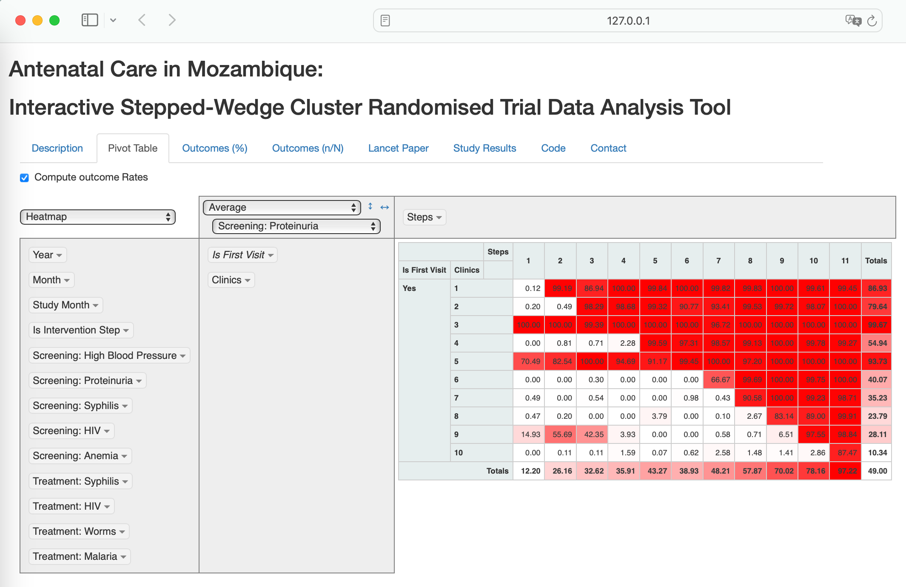
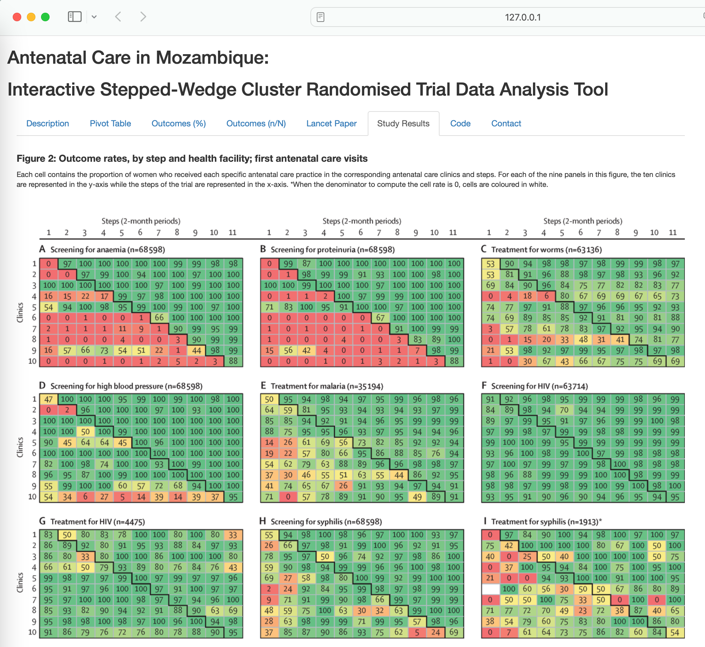

# Antenatal Care in Mozambique: Interactive Stepped-Wedge Cluster Randomised Trial Data Analysis Tool

## Overview
This Shiny app replicates the results of a Stepped-Wedge Pragmatic Cluster Randomized Controlled Trial conducted to improve the quality of antenatal care in Mozambique. The trial, published in The Lancet Global Health, evaluated the impact of providing medical supply kits to antenatal care clinics.

[Lancet Global Health paper](https://doi.org/10.1016/S2214-109X(17)30421-7)

## App Features
- **Interactive Data Exploration**: Analyze outcome measures such as blood pressure, proteinuria, and syphilis testing rates through a pivot table widget.
- **User-Friendly Interface**: Designed for users without advanced statistical or programming skills.
- **Data Accessibility**: Enhance scientific reproducibility by making trial data accessible and analyzable for researchers, practitioners, and policymakers.
- **Source Code and Dataset**: Available for download within the app and on GitHub.

## Trial Details

High levels of maternal and newborn mortality and morbidity remain a challenge in many low-income countries. Several interventions delivered during antenatal care can improve outcomes, but stockouts of medical supplies often hinder implementation. This trial assessed whether a supply chain strategy based on the provision of kits could improve the quality of care.

- **Study Design**: Pragmatic, stepped-wedge, cluster-randomized controlled trial at ten antenatal care clinics in Mozambique.
- **Intervention**: Included kits with medical supplies, a cupboard to store supplies, a tracking sheet to monitor stocks, and a one-day training session.
- **Primary Outcomes**: Proportion of women screened for anaemia and proteinuria, and the proportion who received mebendazole in the first antenatal care visit.
- **Results**: Significant improvements in screening and treatment practices were observed.

## Access the App
Play with the App test instance at: [https://ebergel.shinyapps.io/202407021245/](https://ebergel.shinyapps.io/202407021245/)


## App Screenshots






## Repository Contents
- `202407021245/`: Directory containing the Shiny app source code.
- `data/`: Directory containing the dataset used in the app.
- `README.md`: This file.
- `LICENSE`: License for the repository.

## Installation and Usage
To run the app locally:

1. Clone this repository:

   ```bash
   git clone https://github.com/ebergel/ANCMozambique.git
   ```
2. Navigate to the app directory:

   ```bash
   cd ANCMozambique/202407021245
   ```
3. Install the required packages (if not already installed):

   ```R
   install.packages(c("shiny", "htmlwidgets", "dplyr", "rpivotTable", "shinyAce", "descr"))
   ```
4. Run the app:

   ```R
   shiny::runApp()
   ```

## Citation
If you use this app or the dataset, please cite the original trial publication:
Betrán, A.P., Bergel, E., Griffin, S., Melo, A., Nguyen, M.H., Carbonell, A., Mondlane, S., Merialdi, M., Temmerman, M., Gülmezoglu, A.M. (2018). Provision of medical supply kits to improve quality of antenatal care in Mozambique: a stepped-wedge cluster randomised trial. The Lancet Global Health, 6(1), e57-e65.

## License

[](./LICENSE)


## Contact
For any questions or issues, please contact Eduardo Bergel at X (Twitter): 
[@BergelEduardo](https://twitter.com/BergelEduardo)

####  <br> 

